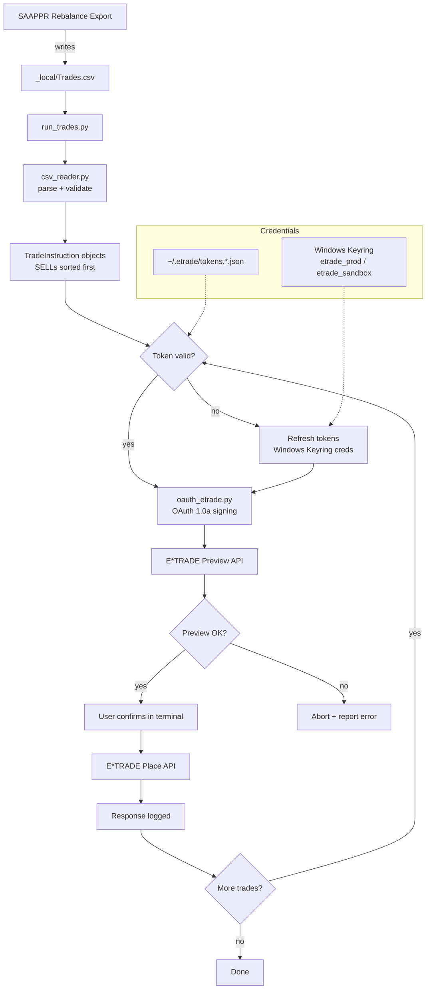

# EAT — Pipeline Map

End-to-end flow from SAAPPR's CSV export to executed trades at E*TRADE.

## Key Nodes

| Node | File | Purpose |
|---|---|---|
| `csv_reader.py` | `utils/csv_reader.py` | Parses CSV → `TradeInstruction`; enforces SELLs-before-BUYs |
| `oauth_etrade.py` | `auth/oauth_etrade.py` | Custom OAuth 1.0a (pyetrade's built-in flow doesn't work with E*TRADE) |
| `run_trades.py` | root | Entry point; orchestrates preview → confirm → place per trade |
| Token cache | `~/.etrade/tokens.{sandbox,prod}.json` | Auto-refreshed; expires midnight US Eastern |
| Credentials | Windows Keyring (`etrade_prod` / `etrade_sandbox`) | Never hardcoded |

## Upstream / Downstream

- **Upstream:** SAAPPR's Rebalance Export (Excel macro) writes to `Forge/EAT/_local/Trades.csv`
- **Downstream:** E*TRADE API — production at `api.etrade.com`, sandbox data at `apisb.etrade.com` (token endpoints always prod host)

## Alternate Path — Fidelity

For Fidelity trades, the TamperMonkey userscript at `_local/userscripts/fidelity-trade-modal/fidelity-trade-modal.user.js` replaces the API path: CSV → paste into panel → script drives Fidelity's web modal → manual confirm → place.
